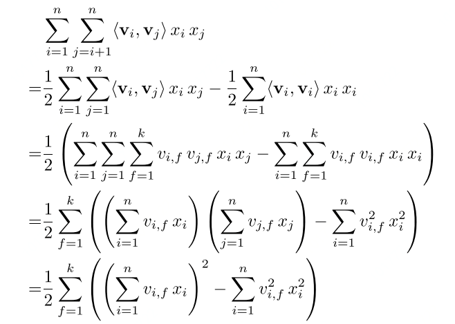

# 传统推荐算法

## 协同过滤族

### UserCF

步骤：

1. 生成user-item共现矩阵

2. 找到与用户x兴趣最相似的n个用户，可以使用余弦相似度、皮尔逊相关系数等方式进行相似度度量。使用皮尔逊相似度时可以使用用户平均分或商品平均分对用户评分进行修正，减少用户评分偏置或商品评分偏置对结果的影响（有些商品，用户本身评分比较高）

   

3. 综合考虑top n用户对物品y的评价：R(x,y) = sum(w(x, u) * R(u, y)) / sum(w(x, u))，u为topn相似用户。即对top n用户对物品y进行加权平均

   

缺点：

1. 在用户数远大于物品数的时候，用户相似度矩阵存储需要大量开销，以n^2的速度增长
2. 用户历史行为稀疏，不适合于那些获得正反馈困难的场景

### ItemCF

步骤与UserCF类似

1. 生成user-item共现矩阵
2. 根据用户的正反馈列表，计算相似度，找出top k最相似物品
3. 对相似集合中的物品，按如下方式计算相似度，R(x,y)=sum(w(p,y)R(x,p))，p为用户正反馈集合中的物品

### UserCF与ItemCF的应用场景

UserCF适合社交、新闻这样的场景，这些场景中新闻及时性、热点性、多样性比相关性更重要，ItemCF适合兴趣变化较为稳定的应用，如电商

### CF方法的缺点

CF无法将两个商品相似的信息推广到其他物品的计算上，导致头部效应明显（头部商品容易跟其他商品计算相似度），泛化能力弱。

   

### 矩阵分解-CF扩展

矩阵分解方法是协同过滤的发展，解决CF方法相似度计算无法推广到其他商品的问题

矩阵分解方法将nm的用户共现矩阵分解为nk的用户矩阵和km的物品矩阵，每个物品和用户用k维向量表示，这样任意一个物品都可以和任意一个用户进行相似度计算：r=u * p，及用户向量和物品向量做点积

#### 矩阵分解的求解方法

1. 特征值分解，只适用方阵，这里不适合

2. 奇异值分解，将矩阵分解为M=UEV，E为对角阵，取E中较大的k个值。要求原始矩阵是稠密的，而且分解复杂度高O(nmm)，不适合互联网海量数据场景

3. 梯度下降，直接学习用户和物品隐向量，优化目标是让用户真实评分与通过隐向量计算的评分尽可能接近

   

   在预估用户对物品打分的时候可以加一些偏置项，减小用户或物品打分的偏差

   

#### 矩阵分解方法的优缺点

优点：

1. 比协同过滤具有更强的泛化性
2. 不需要存用户相似性或物品相似性矩阵，空间复杂度低
3. 隐向量思想与深度学习embedding类似，可以与其他特征拼接，较为灵活

缺点：

1. 有局限，不能加入用户、物品和上下文相关特征

 

## 逻辑回归族

逻辑回归将推荐问题转化为点击率预估问题，可以综合考虑用户、物品、上下文特征，是深度学习模型的雏形

优点：

1. 是否点击服从伯努利分布，数学逻辑充分
2. 可解释强，可以得到每个特征的重要性程度
3. 训练和在线腿短高效

缺点：

1. 表达能力不强，无法进行特征交叉、筛选

## 因子分解机族

因子分解机方法可以解决逻辑回归不能够进行特征交叉问题

### POLY2

one-hot之后，对两两特征进行交叉

缺点：

1. 互联网数据非常稀疏，one-hot之后再做交叉将会导致特征极度稀疏，导致大部分特征权重缺乏有效的训练，可能无法收敛
2. 权重参数由n变成了n^2，极大地增加了训练复杂度

### FM

FM给每个特征一个隐向量，特征之间的隐向量点击得到权重

优势：

1. 能更好解决特征稀疏性问题，POLY2中特征x_i和x_j的权重w_ij只有当x_i和x_j共现是才会得到训练，但是现在只要x_i或x_j出现一个，就能得到训练，泛化能力更强

2. 参数数量由n^2降到nk，k为隐向量维度，训练复杂度也可以降到O(n,k)

   

### FFM

FFM在FM的基础上提出来域的概念，每个特征不再是只有一个隐向量，而是有F个，F为one-hot之前特征个数

即每个特征有一个和每个特征域相关的隐向量，有点多视角的意思

FFM的参数个数是nkf，f为特征域的个数，FFM不能像FM那样简化，训练复杂度为O(kn^2)

### FM模型族的局限

FM模型理论上可以进行更高阶的特征组合，但是，由于组合爆炸，训练复杂度会急剧上升，工程上不可行

## 组合模型

### GBDT+LR

特征转换过程：

1. 样本输入到某棵树后，只会有一个叶子节点被选中，选中了为1，其他的为0，得到这棵树的特征向量
2. 所有树的特征向量连接在一起得到最终输入模型的特征向量

优势：

1. gbdt树的深度决定了特征交叉的阶数，因为每一层都是通过一个特征分割的，这样gbdt很容易就进行高阶交叉
2. 自动化特征工程

局限：

1. 容易过拟合
2. 特征转换有信息缺失

### LS-PLM

LS-PLM也叫MLR，它的主要思想是不同用户、场景的样本应该使用不同的模型预估，如果使用同一个模型，样本之间会进行干扰。举个例子，女性用户可能更偏爱点女装广告，如果把男性用户点击数码产品广告的数据考虑进来，可能会对模型学习不利。

其中pi(x)为m个分类器softmax之后的权重，eta(x)为每个LR模型，m是个超参，阿里妈妈的经验值是12

优势：

1. 端到端的非线性学习能力
2. 模型的稀疏性强，模型中可以使用L1参数，使得权重具有较高的稀疏性，线上只使用非零权重的特征

LS-PLM可以看成一个三层的神经网络，中间层由m个神经元组成，对应m个分片。这m个神经元计算的是**注意力**(attention)得分。