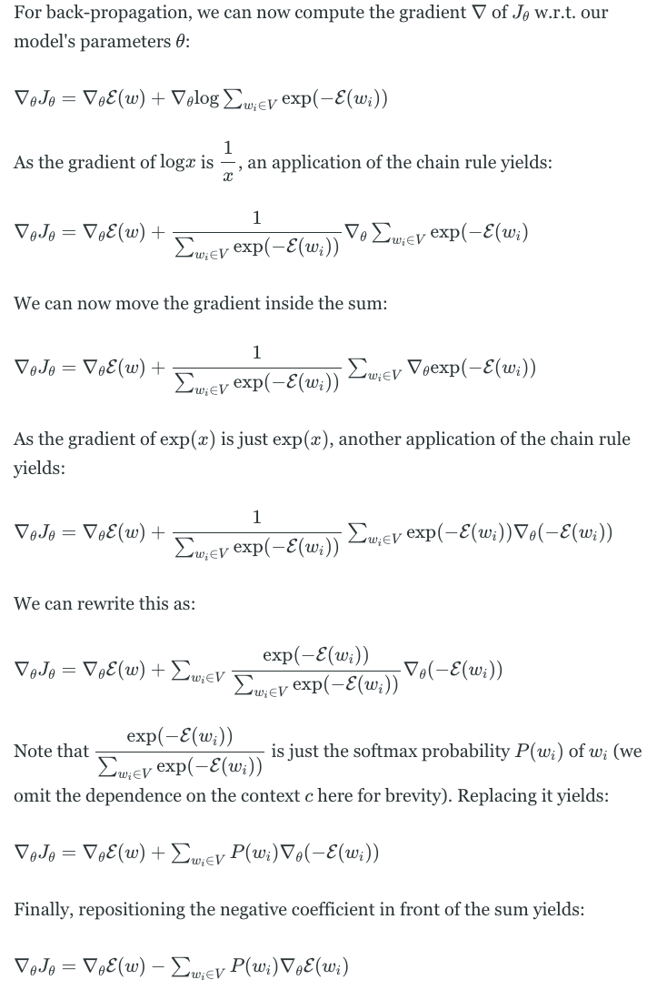

# Candidate Sampling

Candidate sampling方法最初出现在NLP word embedding任务中，原始softmax在对字典中所有词分类的时候，softmax计算量很大，candidate sampling就是为了解决效率问题，通过抽样的方法逼近估计真实效果。

## 原理

以词分类任务为例，损失函数可以写成：

变型后，用$\epsilon(w)$代替$-h^{T}v_w$

求导之后变型：

可以看到，梯度可以分成两部分，一部分是对当前target word的加强，另一部分是所有单词的削弱，削弱的权重与单词的概率相关。而第二项可以看成是一个期望。

而candidate sampling的核心是估计这个期望

## Noise Constrastive Estimation (NCE)

[NCE笔记](0011-NCE_loss.md)

## Negative Sampling

[Negative Sampling笔记](0012-Negative_sampling_loss.md)
## Sampled softmax

[Sampled Softmax笔记](0012-Negative_sampling_loss.md)

## 参考

1. [On word embeddings - Part 2: Approximating the Softmax](https://ruder.io/word-embeddings-softmax/index.html#fn18)
2. [Notes on Noise Contrastive Estimation and Negative Sampling](https://arxiv.org/abs/1410.8251)