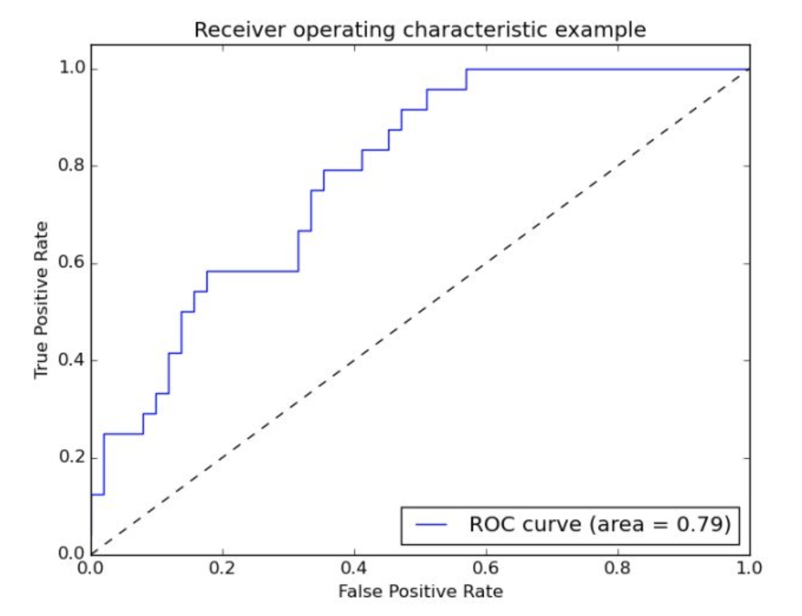

# AUC

对于二分类，分类结果可归为四类：

||预测正类|预测负类|
|-|-|-|
|真实正类|TP|FN|
|真实负类|FP|TN|

注：T/F表示是否分错，P/N表示分到了正类或负类

## ROC曲线
通常二分类器会输出一个0～1之间的实数，如果设定一个阈值α，则一般会将输出概率大于α的归为正类，小于的归为负类。

给定所有样本的输出概率，我们可以将输出概率从大到小排序。从前往后遍历所有样本，将当前样本的输出概率作为α，则前面的所有样本会归为正类，后面的是负类。在所有样本都分完类后，就可以计算TP，FN，FP和TN了。

这里有两个重要的统计量：

- 真正类率（真实为真类，预测也为正类）：$TPR=\frac{TP}{TP+FN}$
- 假正类率（真实为负类，预测为正类，误判）：$FPR=\frac{FP}{FP+TN}$

将所有样本的(FPR,TPR)作为坐标，按顺序依次画出即可得到ROC曲线。

如图所示，对角线表示随机模型。(0,1)是理想模型

通常来说，如果一个ROC曲线如果能把另外一个完全包住，则说明前者分类器性能更优越。但是如果有交叉，就很难判断孰优孰劣了，这时可通过计算AUC(Area Under Curve)来比较。

## AUC计算

AUC的物理含义:随机从正负样本中选取一对正负样本，其中正样本的得分大于负样本的概率。证明参考：[这篇博客](https://tracholar.github.io/machine-learning/2018/01/26/auc.html)。

以下是截图，其中$N\_(t),N_{+}(t)$分别表示分类阈值大于t时负样本和正样本数量，$N\_, N_{+}$分别表示所有负样本和正样本的数量

基于AUC的物理含义，AUC可使用如下方式计算：将测试集的正负样本按照模型预测得分从小到大排序，对于第$j$个正样本，假设它的排序为$r_j$，那么说明排在这个正样本前面的总样本有$r_j-1$个，其中正样本有$j−1$个（因为这个正样本在所有的正样本里面排第j）， 所以排在第$j$个正样本前面(得分比它小)的负样本个数为 $r_j−j$个。也就是说，对于第$j$个正样本来说，其得分比随机取的一个负样本大(排序比它靠后)的概率是 $(r_j−j)/N\_$,其中N−是总的负样本数目。所以，平均下来，随机取的正样本得分比负样本大的概率为
$$
AUC = \frac{1}{N_+} \sum_{j=1}^{N_+}(r_j - j)/N\_- = \frac{\sum_{j=1}^{N_+}r_j - N_+(N_+ + 1)/2}{N_+N_-}
$$

## AUC的优缺点

优点：
1. AUC指标衡量的是模型的排序能力，适合排序模型
2. 对正负例均衡并不敏感，在训练模型的时候，如果正负比例差异比较大，例如正负比例为1:1000，训练模型的时候通常要对负样本进行下采样。当一个模型训练完了之后，用负样本下采样后的测试集计算出来的AUC和未采样的测试集计算的AUC基本一致。根据上节的推导结果，对于正样本$r_j$，如果抽样是随机的，分数$(r_j - j)/N\_$不变，分子分母同比例变小。
3. 不需要像准确率、F1等指标设定阈值

缺点：
1. 对预估值变化不敏感，AUC只关心序。无法衡量模型预估偏差。

## GAUC

在广告、推荐等业务中，实际线上是对单个用户进行打分排序，而AUC是对所有样本进行打分排序，与实际不符。可以根据用户对样本分组，每组分别计算auc，再根据样本量进行加权平均。

$$
GAUC=\frac{\sum_{i} impression_{i}\times uAUC}{\sum_{i} impression_{i}}
$$

