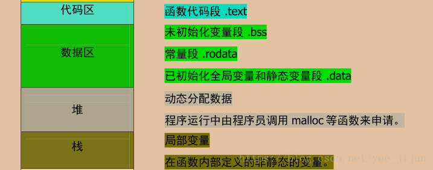
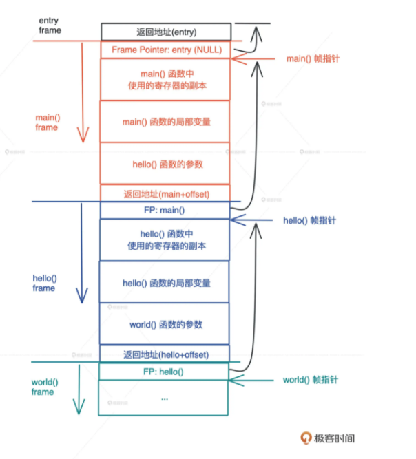
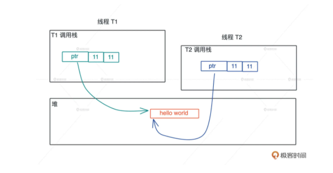

# 内存的栈和堆

## 内存分类

内存分类有多种标准，这里采取四分类标准



> text是只读的

rust语言内存示例
```rust
static MAX: u32 = 0;

fn foo() {}

fn main() {
    let hello = "hello world".to_string();
    let data = Box::new(1);

    // string literals 指向 RODATA 地址
    println!("RODATA: {:p}", "hello world!");
    // static 变量在 DATA section
    println!("DATA (static var): {:p}", &MAX);
    // function 在 TEXT
    println!("TEXT (function): {:p}", foo as *const ());
    // String 结构体分配在栈上，所以其引用指向一个栈地址
    println!("STACK (&hello): {:p}", &hello);
    // 需要通过解引用获取其堆上数据，然后取其引用
    println!("HEAP (&*hello): {:p}", &*hello);
    // Box 实现了 Pointer trait 无需额外解引用
    println!("HEAP (box impl Pointer) {:p} {:p}", data, &*data);
}

```

## 栈

1. 栈是程序运行的基础。每当一个函数被调用时，一块连续的内存就会在栈顶被分配出来，这块内存被称为帧（frame）。
2. 栈的空间有限，容易发生栈溢出，如无限递归调用
3. **在编译时，一切无法确定大小或者大小可以改变的数据，都无法安全地放在栈上，最好放在堆上**。如函数中String类型局部变量，真正的内容是放在对上的，指向内容的指针放在栈内
4. 由高地址向低地址，连续，快速(写入无需分配，读取有高速缓存)，空间小；
5. 内存随函数调用结束自动释放



## 堆

1. 在对上分配内存会请求操作系统的系统调用，开销大。因此分配内存时会预留空间。
2. 由低地址向高地址，不连续，缓慢，空间大。操作系统使用链表存储空闲内存地址。
3. 堆上的内存需要显示释放，否则会出现内存泄漏。如果堆上内存被释放，但栈上指向堆上内存的相应指针没有被清空，就有可能发生使用已释放内存（use after free）的情况
4. 堆上内存有更加灵活的生命周期，可以在不同的调用栈之间共享数据。



### GC与ARC

1. java采用了追踪式垃圾回收（Tracing GC）的方法，定期标记（mark）找出不再被引用的对象，然后将其清理（sweep）掉，来自动管理内存
2. ObjC 和 Swift 则走了另一条路：自动引用计数（Automatic Reference Counting）。在编译时，它为每个函数插入 retain/release 语句来自动维护堆上对象的引用计数，当引用计数为零的时候，release 语句就释放对象。
3. 从效率上来说，GC 在内存分配和释放上无需额外操作，而 ARC 添加了大量的额外代码处理引用计数，所以 GC 效率更高，吞吐量（throughput）更大。
4. 但是，GC 释放内存的时机是不确定的，释放时引发的 STW（Stop The World），也会导致代码执行的延迟（latency）不确定。所以一般携带 GC 的编程语言，不适于做嵌入式系统或者实时系统
5. 我们使用 Android 手机偶尔感觉卡顿，而 iOS 手机却运行丝滑，大多是这个原因。而且做后端服务时，API 或者服务响应时间的 tp99也会受到 GC STW 的影响而表现不佳。(这是感官上的，实际GC比ARC吞吐量高)

## 总结

栈上存放的数据是静态的，固定大小，固定生命周期；堆上存放的数据是动态的，不固定大小，不固定生命周期。